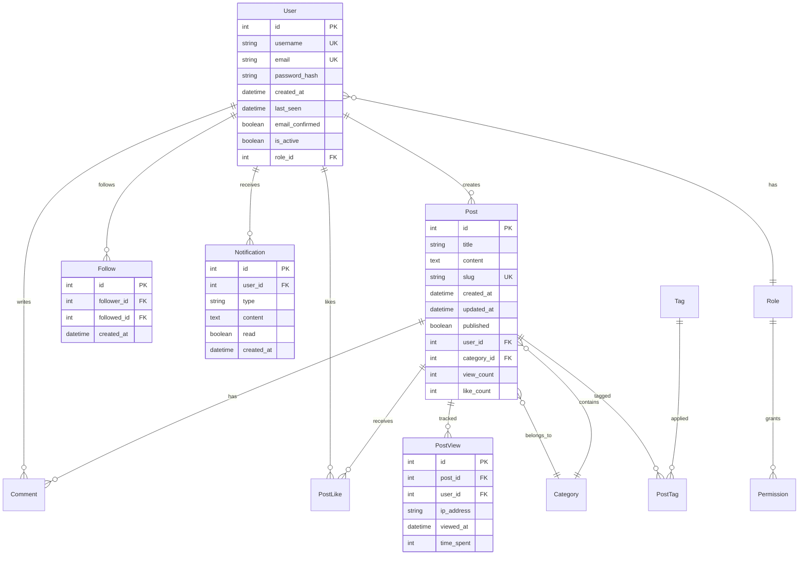

# Design Document

## Overview

This design document outlines the architectural enhancements for the Flask blog application, focusing on educational Flask framework concepts and best practices. The design transforms the current monolithic application into a well-structured, modular system that demonstrates advanced Flask patterns while maintaining the existing functionality and adding new educational features.

The enhanced application will serve as a comprehensive learning platform for Flask development, showcasing real-world patterns used in production applications while remaining accessible for educational purposes.

## Architecture

### Current State Analysis

The existing application is a monolithic Flask app with all functionality in a single `app.py` file. While functional, it doesn't demonstrate Flask best practices for larger applications. The current structure includes:

- Single file application (969 lines)
- Direct Flask app instantiation
- Mixed concerns (routes, models, utilities in one file)
- Basic SQLAlchemy models
- Flask-Login authentication
- Flask-SocketIO for real-time features

### Target Architecture

The enhanced architecture will follow Flask best practices with clear separation of concerns:

```
flask-blog-enhanced/
├── app/
│   ├── __init__.py              # Application factory
│   ├── config.py                # Configuration management
│   ├── extensions.py            # Extension initialization
│   ├── models/                  # Database models
│   │   ├── __init__.py
│   │   ├── user.py
│   │   ├── blog.py
│   │   └── analytics.py
│   ├── blueprints/              # Application blueprints
│   │   ├── __init__.py
│   │   ├── auth/                # Authentication blueprint
│   │   ├── blog/                # Blog functionality blueprint
│   │   ├── admin/               # Admin panel blueprint
│   │   ├── api/                 # REST API blueprint
│   │   └── realtime/            # WebSocket blueprint
│   ├── middleware/              # Custom middleware
│   │   ├── __init__.py
│   │   ├── logging.py
│   │   ├── rate_limiting.py
│   │   └── caching.py
│   ├── utils/                   # Utility functions
│   │   ├── __init__.py
│   │   ├── decorators.py
│   │   ├── validators.py
│   │   └── helpers.py
│   ├── services/                # Business logic services
│   │   ├── __init__.py
│   │   ├── auth_service.py
│   │   ├── blog_service.py
│   │   └── analytics_service.py
│   └── templates/               # Jinja2 templates
├── tests/                       # Test suite
│   ├── __init__.py
│   ├── conftest.py             # Pytest configuration
│   ├── unit/                   # Unit tests
│   ├── integration/            # Integration tests
│   └── functional/             # Functional tests
├── migrations/                  # Database migrations
├── docker/                     # Docker configuration
├── scripts/                    # Deployment scripts
├── requirements/               # Environment-specific requirements
├── .env.example               # Environment variables template
├── docker-compose.yml         # Development environment
├── Dockerfile                 # Production container
└── run.py                     # Application entry point
```

## Components and Interfaces

### 1. Application Factory Pattern

**Purpose:** Demonstrate proper Flask application initialization and configuration management.

**Implementation:**
- `app/__init__.py`: Contains `create_app()` factory function
- Supports multiple environments (development, testing, production)
- Proper extension initialization order
- Blueprint registration with error handling

**Key Learning Concepts:**
- Application contexts and request contexts
- Extension initialization patterns
- Configuration management strategies
- Environment-based configuration

### 2. Blueprint Architecture

**Purpose:** Teach modular application design and URL routing organization.

**Blueprints Structure:**

#### Auth Blueprint (`app/blueprints/auth/`)
- Routes: `/auth/login`, `/auth/register`, `/auth/logout`, `/auth/profile`
- Templates: Login, register, profile forms
- Functionality: User authentication, registration, profile management
- Learning Focus: Form handling, session management, password hashing

#### Blog Blueprint (`app/blueprints/blog/`)
- Routes: `/`, `/posts`, `/posts/<id>`, `/create`, `/categories`
- Templates: Post listing, detail views, creation forms
- Functionality: CRUD operations for posts and comments
- Learning Focus: Database relationships, pagination, file uploads

#### Admin Blueprint (`app/blueprints/admin/`)
- Routes: `/admin/*` (dashboard, users, posts, analytics)
- Templates: Admin dashboard, management interfaces
- Functionality: User management, content moderation, analytics
- Learning Focus: Role-based access control, admin interfaces

#### API Blueprint (`app/blueprints/api/`)
- Routes: `/api/v1/*` (RESTful endpoints)
- Functionality: JSON API for mobile/external access
- Learning Focus: REST principles, JSON serialization, API versioning

#### Realtime Blueprint (`app/blueprints/realtime/`)
- WebSocket endpoints for real-time features
- Functionality: Live notifications, real-time comments
- Learning Focus: WebSocket handling, event-driven architecture

### 3. Middleware System

**Purpose:** Demonstrate request/response processing and cross-cutting concerns.

**Components:**

#### Logging Middleware (`app/middleware/logging.py`)
- Request/response logging with timing
- Structured logging with different levels
- Request ID tracking for debugging
- Learning Focus: Request lifecycle, logging best practices

#### Rate Limiting Middleware (`app/middleware/rate_limiting.py`)
- IP-based and user-based rate limiting
- Redis-backed rate limiting with sliding windows
- Custom rate limit decorators
- Learning Focus: Security, Redis integration, decorators

#### Caching Middleware (`app/middleware/caching.py`)
- Response caching with ETags
- Cache invalidation strategies
- Cache warming for popular content
- Learning Focus: HTTP caching, performance optimization

### 4. Database Layer Enhancement

**Purpose:** Demonstrate advanced SQLAlchemy patterns and database best practices.

**Enhanced Models:**

#### User Model Extensions
```python
class User(db.Model, UserMixin):
    # Existing fields...
    
    # New fields for learning
    last_seen = db.Column(db.DateTime, default=datetime.utcnow)
    email_confirmed = db.Column(db.Boolean, default=False)
    role_id = db.Column(db.Integer, db.ForeignKey('role.id'))
    
    # Advanced relationships
    followers = db.relationship('Follow', foreign_keys='Follow.followed_id',
                               backref='followed', lazy='dynamic')
    following = db.relationship('Follow', foreign_keys='Follow.follower_id',
                               backref='follower', lazy='dynamic')
    
    # Hybrid properties for learning
    @hybrid_property
    def full_name(self):
        return f"{self.first_name} {self.last_name}"
    
    # Class methods for learning
    @classmethod
    def get_active_users(cls):
        return cls.query.filter_by(is_active=True)
```

#### Analytics Models
```python
class PostView(db.Model):
    id = db.Column(db.Integer, primary_key=True)
    post_id = db.Column(db.Integer, db.ForeignKey('post.id'))
    user_id = db.Column(db.Integer, db.ForeignKey('user.id'), nullable=True)
    ip_address = db.Column(db.String(45))
    user_agent = db.Column(db.Text)
    viewed_at = db.Column(db.DateTime, default=datetime.utcnow)
    time_spent = db.Column(db.Integer)  # seconds
```

**Learning Focus:**
- Advanced relationships (many-to-many, self-referential)
- Hybrid properties and methods
- Database indexes and constraints
- Query optimization techniques
- Database migrations with Flask-Migrate

### 5. Service Layer

**Purpose:** Demonstrate business logic separation and testable code organization.

**Services:**

#### AuthService (`app/services/auth_service.py`)
```python
class AuthService:
    @staticmethod
    def register_user(username, email, password):
        # Registration logic with validation
        # Email confirmation workflow
        # Return success/error responses
    
    @staticmethod
    def authenticate_user(username, password):
        # Authentication logic
        # Login attempt tracking
        # Account lockout handling
```

#### BlogService (`app/services/blog_service.py`)
```python
class BlogService:
    @staticmethod
    def create_post(user_id, title, content, category_id=None):
        # Post creation with validation
        # Image processing
        # Notification triggering
    
    @staticmethod
    def get_trending_posts(limit=10):
        # Algorithm for trending content
        # Caching implementation
        # Performance optimization
```

**Learning Focus:**
- Service layer patterns
- Business logic organization
- Dependency injection concepts
- Testable code design

### 6. Testing Framework

**Purpose:** Demonstrate comprehensive testing strategies for Flask applications.

**Test Structure:**

#### Unit Tests (`tests/unit/`)
- Model testing with test database
- Service layer testing with mocks
- Utility function testing
- Learning Focus: Isolated testing, mocking, fixtures

#### Integration Tests (`tests/integration/`)
- Database integration testing
- Blueprint integration testing
- API endpoint testing
- Learning Focus: Component interaction testing

#### Functional Tests (`tests/functional/`)
- End-to-end user workflows
- Browser automation with Selenium
- API workflow testing
- Learning Focus: User experience testing, automation

**Test Configuration:**
```python
# tests/conftest.py
@pytest.fixture
def app():
    app = create_app('testing')
    with app.app_context():
        db.create_all()
        yield app
        db.drop_all()

@pytest.fixture
def client(app):
    return app.test_client()

@pytest.fixture
def authenticated_user(client):
    # Create and login test user
    pass
```

## Data Models

### Enhanced Database Schema

The enhanced schema builds upon the existing models while adding new educational features:



### Migration Strategy

**Learning Focus:** Database versioning and migration management

1. **Initial Migration:** Convert existing schema to Alembic-managed
2. **Feature Migrations:** Add new tables and relationships incrementally
3. **Data Migrations:** Populate new fields and relationships
4. **Index Migrations:** Add performance indexes

## Error Handling

### Comprehensive Error Management

**Purpose:** Demonstrate proper error handling and user experience in Flask applications.

**Error Handler Structure:**
```python
# app/blueprints/errors.py
@bp.errorhandler(404)
def not_found_error(error):
    return render_template('errors/404.html'), 404

@bp.errorhandler(500)
def internal_error(error):
    db.session.rollback()
    return render_template('errors/500.html'), 500

@bp.errorhandler(ValidationError)
def validation_error(error):
    return jsonify({'error': str(error)}), 400
```

**Custom Exception Classes:**
```python
class BlogException(Exception):
    """Base exception for blog application"""
    pass

class ValidationError(BlogException):
    """Raised when validation fails"""
    pass

class AuthenticationError(BlogException):
    """Raised when authentication fails"""
    pass
```

**Learning Focus:**
- Exception hierarchy design
- Error logging and monitoring
- User-friendly error messages
- API error responses

## Testing Strategy

### Comprehensive Testing Approach

**Purpose:** Demonstrate testing best practices and ensure code quality.

**Testing Pyramid:**

#### Unit Tests (70%)
- Model methods and properties
- Service layer functions
- Utility functions and decorators
- Form validation logic

#### Integration Tests (20%)
- Database operations
- Blueprint interactions
- External service integration
- Cache and session handling

#### Functional Tests (10%)
- User workflows (registration, posting, commenting)
- Admin workflows (user management, content moderation)
- API workflows (authentication, CRUD operations)
- Real-time features (notifications, live updates)

**Test Data Management:**
```python
# tests/factories.py
class UserFactory(factory.Factory):
    class Meta:
        model = User
    
    username = factory.Sequence(lambda n: f"user{n}")
    email = factory.LazyAttribute(lambda obj: f"{obj.username}@example.com")
    password_hash = factory.LazyFunction(lambda: generate_password_hash("password"))

class PostFactory(factory.Factory):
    class Meta:
        model = Post
    
    title = factory.Faker('sentence', nb_words=4)
    content = factory.Faker('text', max_nb_chars=1000)
    author = factory.SubFactory(UserFactory)
```

**Performance Testing:**
- Load testing with locust
- Database query profiling
- Cache hit rate monitoring
- Response time benchmarking

**Learning Focus:**
- Test-driven development (TDD)
- Test data factories and fixtures
- Mocking external dependencies
- Performance testing strategies
- Continuous integration setup